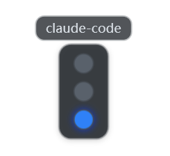
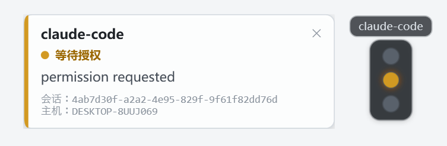
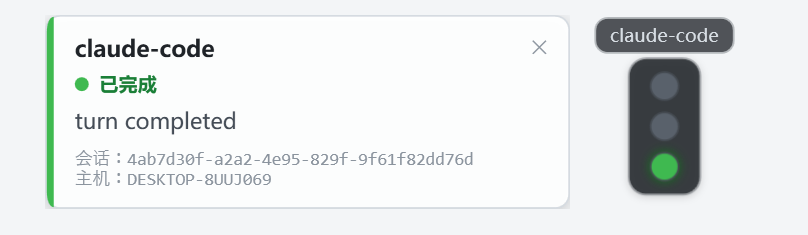
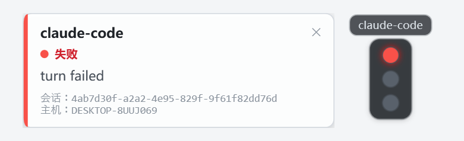

# AgentBeacon

> 你的 AI Agent 们，在你 Windows 桌面右上角的一排"红绿灯"。

同时开着好几个 Claude Code / Codex 会话干活时，你大概也有这些时刻：

- 任务一跑十几分钟，你隔一会儿就得切回终端看看"跑完没"——打断手头的事，又怕它早就在等你；
- Agent 停在权限确认上没人理，等你发现时半天已经过去了；
- 一个会话悄悄挂了，你两个小时后才知道。

AgentBeacon 把这些全部变成**余光扫一眼**的事：每个 Agent 会话在桌面右上角有一盏独立的红绿灯，蓝灯在转、黄灯喊你、绿灯收工、红灯出事。然后你就可以安心去干别的了（是的，安稳摸鱼）。

## 它能帮你做什么

- **不用反复查询**：agent 还在跑就是蓝灯亮着，扫一眼就知道，不必切终端、翻 tmux、看日志。
- **approval 秒级响应**：Agent 一等你授权，黄灯亮起 + 一张卡片从灯旁边弹出告诉你它在等什么；点完 yes 灯立刻变蓝，回去继续干自己的事。
- **多 Agent 一屏管理**：每个会话一盏独立的灯（同一种 Agent 开几个会话就是几盏），谁在干活、谁在等你、谁完成了、谁挂了，一眼全知道。
- **挂了立刻看见**：红灯长亮 + 错误卡片，不用等你自己撞上去。
- **零打扰**：永远置顶但不抢焦点、不进任务栏、无边框；你打字它不碰你的光标；没有任何会话时整个指示器**完全隐身**。

## 它长什么样

每个 Agent 会话 = 一个竖向三灯模块，上方是 Agent 名字：

```
 Claude Code          OpenCode
 ┌─────────┐          ┌─────────┐
 │    ·    │          │    ●    │  ← 红 = failed（挂了）
 │    ●    │          │    ·    │  ← 黄 = approval（等你授权）
 │    ·    │          │    ·    │  ← 底灯 = running 蓝 / completed 绿
 └─────────┘          └─────────┘
```

| 灯位 / 颜色 | 状态 | 含义 | 通知卡片 |
| --- | --- | --- | --- |
| 底部 🔵 蓝 | `running` | 正在干活，别打断 | 不弹 |
| 中间 🟡 黄 | `approval` | 在等你授权，快去 | 弹出 30 秒后收回，**黄灯保持** |
| 底部 🟢 绿 | `completed` | 本轮完成 | 弹出 30 秒后收回，绿灯保留 5 分钟 |
| 顶部 🔴 红 | `failed` | 挂了，去看错误 | 弹出 30 秒后收回，**红灯长亮** |

<table>
  <tr>
    <td></td>
    <td></td>
  </tr>
  <tr>
    <td></td>
    <td></td>
  </tr>
</table>
状态变化时新亮的灯（黄/绿/红）会像真实红绿灯一样**闪烁数秒**提醒你；卡片从对应灯的左侧弹出、展示 agent / 状态 / 消息，停留 30 秒后自动收回——**卡片消失 ≠ 状态消失**，灯才是持久信号。多张卡片同时弹出时自动避让不重叠。

日常小操作：**左键拖动**任意灯可挪动整个灯列；**右键 → 重命名此灯**可给同名会话起个能分清的名字（如"前端任务"/"修数据库"，Enter 确认，持久化保存）；**右键 → 关闭此灯**可清掉不再关心的会话（该会话一旦有新状态，灯会自动重建）。

## 环境要求

| 组件 | 要求 |
| --- | --- |
| Windows 桌面端（Receiver + Indicator） | Windows 10/11。**用发布包分发时接收方零依赖**（.NET 运行时已打进去）；从源码跑则需要 .NET 10 SDK |
| Agent 端 | 任何能发 HTTP POST 的环境（WSL / Linux / macOS / Windows） |
| Claude Code 插件 Adapter | Claude Code 2.1+（hooks / 插件机制，验证版本 2.1.250） |
| 网络 | Agent 能访问 Receiver 的 `IP:端口`；WSL 与 Windows 共享本地网络时直接用 `127.0.0.1` |

无数据库、无后台服务：Receiver 和 Indicator 就是两个小进程，状态全在内存里。

## 快速开始

### 0. 发给别人用：一个文件夹搞定

**在 WSL 里**一条命令（交叉编译，不需要 PowerShell）：

```bash
bash scripts/dist.sh --zip
```

产出 `dist/agentbeacon-win-x64/`（约 247 MB，.NET 运行时已包含）和同名 zip。**把这个文件夹发给别人**，对方：

1. 放到一个固定位置（如 `C:\AgentBeacon`）
2. **双击 `install.bat`**（可先编辑 `agentbeacon.json`，或 `install.bat -Token key -Port 8765`）
3. 完成 —— 开机自启 + 后台运行，右上角就是状态灯

不需要装 .NET、不需要源码、不需要构建、不需要敲命令。改配置只动文件夹里的 `agentbeacon.json`，改完重跑 `install.bat`。卸载双击 `uninstall.bat`。

Windows 侧等价脚本是 `scripts\windows\publish.ps1`（从源码机直接发布时用）。

### 1. Windows 端：从源码一键安装（开发模式）

```powershell
git clone <repo> ; cd AgentBeacon
powershell -ExecutionPolicy Bypass -File scripts\windows\install.ps1
```

装完即得：本地目录构建 + **开机自启 + 后台运行**。配置只有一个文件、三个字段 —— 改端口、改 key、免 key 都只动它：

```jsonc
// %LOCALAPPDATA%\AgentBeacon\agentbeacon.json
{
  "bind": "0.0.0.0",
  "port": 8765,
  "token": ""            // 有 key 填这里；空字符串 = 免 key（默认）
}
```

改完重跑一次 `install.ps1`（会停旧进程、重建、按新配置启动）。卸载：`uninstall.ps1`。

不想装开机自启也可以手动前台运行（值同样可以来自 agentbeacon.json）：

```powershell
dotnet run --project receiver -c Release -- --bind 0.0.0.0 --port 8765 --token "<你的token>"
dotnet run --project windows\AgentBeacon.Indicator -c Release --no-build
```

### 2. Agent 端：接入（装一次永久生效）

**Claude Code 用户 —— 插件方式**：

```bash
# 安装
claude plugin marketplace add /path/to/AgentBeacon
claude plugin install agentbeacon@agentbeacon

# 更新（改了插件代码后同步进已安装副本）
claude plugin marketplace update agentbeacon
claude plugin update agentbeacon

# 查看状态
claude plugin list

# 暂时停用 / 恢复
claude plugin disable agentbeacon
claude plugin enable agentbeacon

# 卸载（- 连 marketplace 注册一起清掉则再加：claude plugin marketplace remove agentbeacon）
claude plugin uninstall agentbeacon@agentbeacon
```

**Codex CLI 用户 —— hooks 方式**：

```bash
# 安装：把 AgentBeacon 的 hooks 合并进 ~/.codex/hooks.json（不动已有 hooks）
python3 plugins/codex/install.py

# 卸载
python3 plugins/codex/install.py --remove
```

⚠️ 装完必须做一步：打开 `codex`，运行 `/hooks`，对 AgentBeacon 条目执行 **信任（trust）**——Codex 默认跳过未受信的 hooks。

**共用配置**（两种 Agent 都读这一个文件，填一次即可）：

```jsonc
// ~/.agentbeacon.json
{
  "url": "http://127.0.0.1:8765",   // Windows Receiver 地址（WSL 与 Windows 共享网络）
  "token": null                      // Windows 端配了 key 就填这里，没配保持 null
}
```

之后任何目录直接 `claude` / `codex`，红绿灯自动跟随所有会话。其它 Agent / 脚本用一个 HTTP POST 即可接入，协议见 [docs/protocol.md](docs/protocol.md)。

### 3. 验证

屏幕右上角出现灯 → 正常。没有会话时整个指示器**完全隐身**（也是正常）。开发联调可在 Receiver 配置里开 `"debug": true`，然后 `GET /debug/sessions` 查看收到的全部状态。

## 它是怎么工作的（30 秒版）

```
Agent（Claude Code 插件 / Codex hooks / 任意脚本）
    │  HTTP POST /api/v1/status（单向、无重试、last-received-wins）
    ▼
Receiver（Windows，C# / ASP.NET Core）     ←─ 状态的唯一权威，内存中维护
    │  本机 Named Pipe（全量快照推送）
    ▼
Indicator（Windows，WPF 红绿灯面板）
```

三个进程各自独立启停：Agent 侧不依赖任何 Windows UI 实现，Receiver 不认识任何具体 Agent，Indicator 只订阅状态。AgentBeacon 不参与推理、不接管工具调用、不修改 Agent 本体——它只是把 Hook 捕获的生命周期事件搬运到你眼前。详细介绍见 [docs/architecture.md](docs/architecture.md)。

## 项目状态

- **Round 1**：Protocol v1 + Receiver（HTTP、校验、last-received-wins）
- **Round 2**：Windows Indicator MVP（WPF + Named Pipe IPC、无焦点、completed 墓碑）
- **Round 3**：三灯红绿灯 UI 重构（模块化、卡片锚定、碰撞布局）
- **Round 4**：Claude Code 插件 Adapter（hooks 映射、进程看门狗、两条 failed 上报路径）
- **Round 5**：灯右键关闭 + 拖拽定位
- **Round 6**：鉴权双模式（token / --no-auth）
- **Round 7**：配置文件化（Windows `agentbeacon.json`、插件 `~/.agentbeacon.json`）+ Windows 一键安装/开机自启
- **Round 8**：发布包（WSL 里 `bash scripts/dist.sh` 交叉编译 / Windows 里 `publish.ps1`，单文件夹自包含绿色版，接收方双击 `install.bat` 零环境依赖）
- **Round 9**：托盘图标（右键退出）+ 单实例守卫 + 配置极简化（`token` 空 = 免 key）
- **Round 10**：浅色卡片 + 状态色装饰条、灯变化闪烁（非 running 变更闪 ~4.6s）、卡片停留统一 30s、灯亮度提升（中灰灯罩 + 亮灯辉光）
- **Round 11**：Codex CLI Adapter（`~/.codex/hooks.json` 接入，含信任引导、看门狗）
- **Round 12**：灯右键重命名（就地编辑、按会话持久化、Tooltip 保留真实身份）

自动化测试 **170 个 unique tests** 全部通过（Python 3 套 + C# 2 套；C# 套件在 Linux 与 Windows 原生 .NET 上各跑一遍同一组用例）：

| 套件 | 数量 |
| --- | --- |
| `tests/test_receiver.py` | 42 |
| `tests/test_hook_adapter.py` | 33 |
| `tests/test_codex_adapter.py` | 19 |
| `tests/Receiver.IpcTests` | 18 |
| `tests/Indicator.CoreTests` | 58 |

## 文档

- [docs/architecture.md](docs/architecture.md) — 整体链路与组件职责
- [docs/protocol.md](docs/protocol.md) — v1 HTTP 状态上报协议（含鉴权双模式）
- [docs/ui-policy.md](docs/ui-policy.md) — UI 行为规则（canonical）
- [docs/adapter-claude-code.md](docs/adapter-claude-code.md) — Claude Code Adapter 安装与映射
- [docs/adapter-codex.md](docs/adapter-codex.md) — Codex CLI Adapter 安装与映射
- [docs/round2.md](docs/round2.md) — Round 2 设计与运行说明（历史文档）
- [docs/wsl中开发时的调试说明.md](docs/wsl中开发时的调试说明.md) — WSL 开发时的手工调试指南
